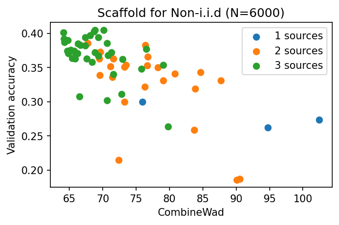

# Optimal-Data-Selection

## To Reviewer CWYY
### Curse of dimensionality 

*Caption:* Data augmentation increases the dimensionality of raw data. We compare Wasserstein Distance (WD) calculations using: OTDD (blue line), augmented data (pink line), and augmented data without raw data sharing (green line, our method). The approximation error, introduced by the randomness of gamma, has a bounded error rate.

## To Reviewer rePU
### Robustness to different FL algorithms and hyper-parameters

 

*Caption:* A comparison of Scaffold, FedNova, and FedAvg in a three-source setting reveals that federated learning (FL) models with lower training loss (indicating successful convergence) exhibit superior validation performance and a more distinct correlation between validation performance and combined Wasserstein Distance (combineWad).
