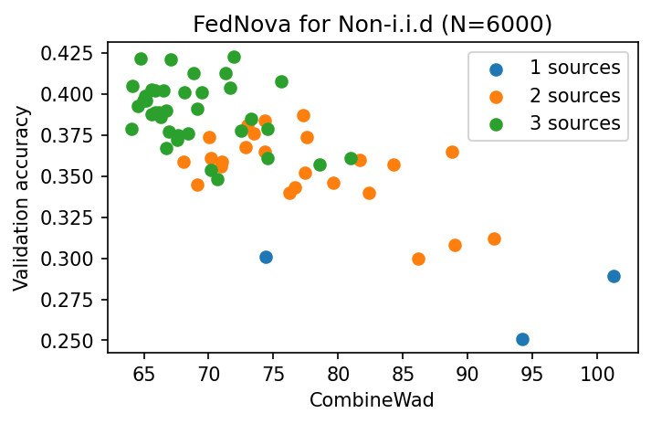

# Optimal-Data-Selection

## To Reviewer CWYY
### Curse of dimensionality 

  

**Caption:** Data augmentation increases the dimensionality of raw data. We compare Wasserstein Distance (WD) calculations using: OTDD (blue line), augmented data (pink line), and augmented data without raw data sharing (green line, our method). The approximation error, introduced by the randomness of gamma, has a bounded error rate.

## To Reviewer rePU
### Robustness to different FL algorithms and hyper-parameters
**Caption:** A comparison of Scaffold, FedNova, and FedAvg in a three-source setting reveals that federated learning (FL) models with lower training loss (indicating successful convergence) exhibit superior validation performance and a more distinct correlation between validation performance and combined Wasserstein Distance (combineWad).

#### CIFAR10, 3 data sources, label distribution 
| Client   | Labels       |
|----------|--------------|
| Client 1 | 1, 2, 3      |
| Client 2 | 3, 4, 5, 6   |
| Client 3 | 6, 7, 8      |
#### N=4000

  
  
  
  

  
  

#### N=6000

  
  
  
  

  
  

